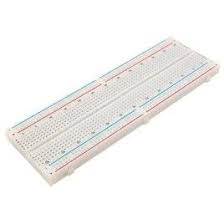

# Soil Moisture Sensor Using AT89C51 Microcontroller

## Project Overview

This project aims to create an automated soil moisture monitoring system using the **AT89C51** microcontroller. The system checks the soil moisture level through a soil moisture sensor and controls a motor (connected to an L293D motor driver) to water the plant when the soil is dry. The system reads moisture levels using an **ADC**, compares the value with a predefined threshold, and then takes appropriate action (either turning the motor on or off).

## Features

- **Soil Condition Monitoring**: Continuously checks the soil moisture level.
- **Moisture Level Detection**: Uses an ADC to read the moisture level from the soil sensor.
- **Motor Control**: Turns the motor on or off based on the moisture level.
- **Motor Driver**: Uses the **L293D** motor driver to control a motor for watering.
- **Low Power Consumption**: Designed to run on minimal power for efficiency.

## Components Required

- **AT89C51 Microcontroller**
- **Soil Moisture Sensor**
  
- **ADC (Analog-to-Digital Converter)** or an external ADC module
- **L293D Motor Driver**
  
- **DC Motor (for watering)**
  
- **Power Supply (5V for AT89C51, 12V for motor)**
- **Breadboard for prototyping**
  
- **Jumper Wires**
  
- **Relay (for controlling motor)**
  
- **LED Display (optional for moisture level display)**
  

## Circuit Diagram

(Include a link to your circuit diagram here or an image if you have one.)

### Connections

1. **Soil Moisture Sensor**:
   - Connect the **analog output** of the soil moisture sensor to the ADC input (P0 in this example).
   
2. **AT89C51 Microcontroller**:
   - **P0** for ADC input (soil moisture sensor).
   - **P1.0 and P1.1** for motor control (connected to L293D).

3. **L293D Motor Driver**:
   - **Motor A (P1.0)**: Controls the motor ON/OFF.
   - **Motor B (P1.1)**: Controls the direction of the motor.

4. **DC Motor**:
   - Connected to the output pins of L293D.

5. **Power Supply**:
   - Provide 5V for AT89C51.
   - Provide 12V (or as required) for the motor.

## Code Explanation

### Soil Moisture Sensor Code (Assembly)

The assembly code for the **AT89C51 microcontroller** performs the following:

1. **ADC Reading**: Reads the moisture level from the soil moisture sensor (via ADC).
2. **Motor Control**: Turns the motor on if the soil moisture is below a predefined threshold (soil is dry), and turns it off if the soil moisture is sufficient.
3. **Delay**: Implements a delay loop between readings to avoid rapid cycling.

### Motor Control Logic

- **Motor ON**: If the moisture level is below the threshold, the motor is activated to water the plant.
- **Motor OFF**: If the moisture level is above the threshold, the motor is turned off.

## How to Use

1. **Assemble the Components**: Build the circuit as per the provided diagram.
2. **Upload Code**: Write the provided assembly code into the AT89C51 microcontroller using a compatible programmer.
3. **Power the System**: Connect the power supply to the microcontroller and motor.
4. **Observe the Motor Operation**: The motor will turn on when the soil moisture is low and turn off when the soil is sufficiently wet.

## Project Images

- **Project Overview Image 1**  
  

- **Project Overview Image 2**  
  

## Future Improvements

- **Wireless Monitoring**: Add wireless modules like Wi-Fi or Bluetooth to remotely monitor soil moisture levels.
- **Cloud Integration**: Integrate with a cloud platform to log and track moisture data.
- **Automated Notifications**: Implement notifications when moisture levels fall below a certain threshold.
- **Sensor Calibration**: Implement automatic calibration for varying soil types.

## License

This project is licensed under the MIT License - see the [LICENSE](LICENSE) file for details.

